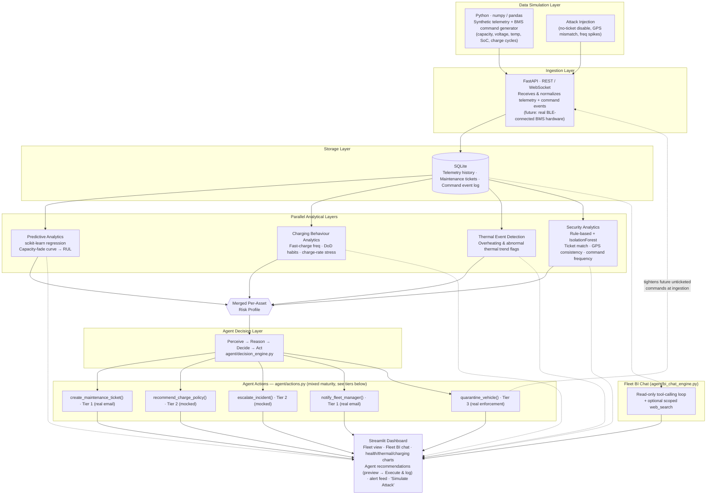
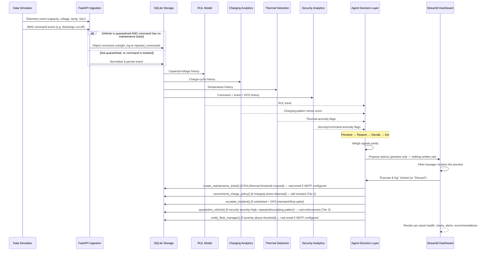
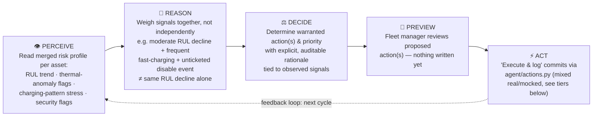
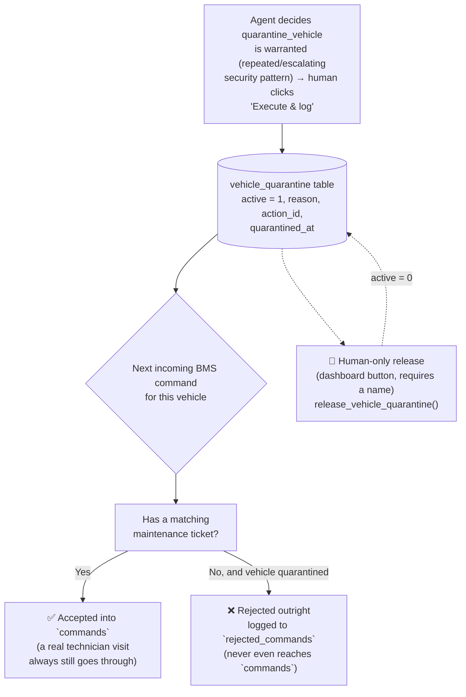
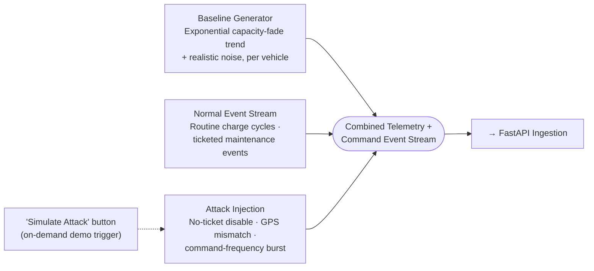
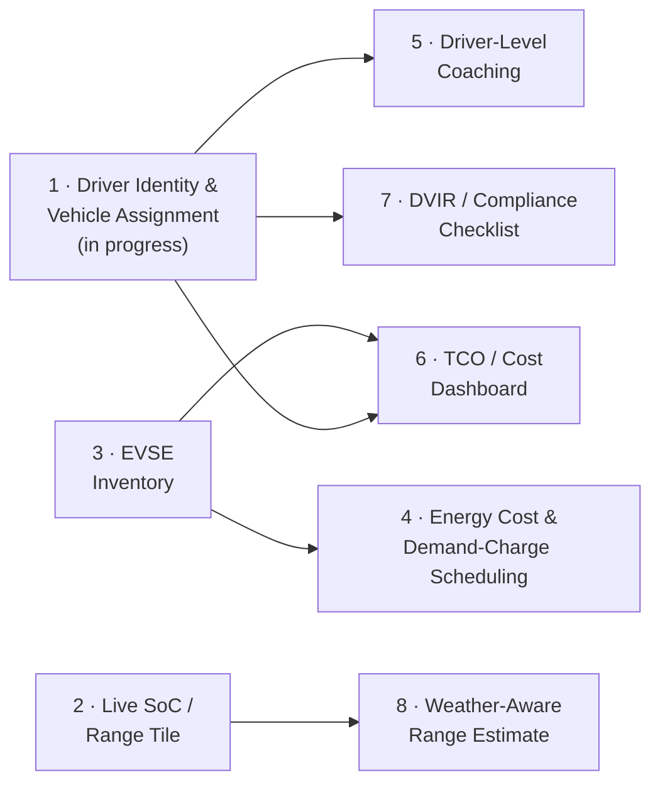

# VoltSentinel

**AI-Powered EV Battery Asset Performance & Security Intelligence Agent**

ET AI Hackathon 2026 — Problem Statement 3: _AI for Industrial EV Supply Chain & Asset Intelligence: Accelerating Net Zero_

> Team Name: `btech10364.23` · Team Members: `Yash Sinha`

---

# Live Link [VOLTSENTINEL](https://voltsentinel.streamlit.app/)

## Table of Contents

1. [Executive Summary](#executive-summary)
2. [Problem Statement & Context](#problem-statement--context)
3. [Objectives](#objectives)
4. [Proposed Solution](#proposed-solution)
5. [System Architecture](#system-architecture)
6. [Data Flow](#data-flow)
7. [Agent Decision Layer](#agent-decision-layer)
8. [Security Enforcement — Quarantine Circuit Breaker](#security-enforcement--quarantine-circuit-breaker)
9. [Fleet BI Chat](#fleet-bi-chat)
10. [Anomaly & Health Detection Logic](#anomaly--health-detection-logic)
11. [Data Simulation Approach](#data-simulation-approach)
12. [Configuration](#configuration)
13. [Alignment with Judging Criteria](#alignment-with-judging-criteria)
14. [Expected Deliverables](#expected-deliverables)
15. [Future Roadmap](#future-roadmap)
16. [Team](#team)
17. [Conclusion](#conclusion)

---

## Executive Summary

VoltSentinel is an AI-powered **Asset Performance Management (APM) agent** for industrial and commercial EV fleets. It monitors battery state-of-health, charging behaviour, and thermal conditions across a fleet; predicts **Remaining Useful Life (RUL)** per asset; recommends charge-discharge policies to extend battery life; and generates predictive maintenance triggers — the core capabilities of an APM agent, applied to EV batteries the way APM is applied to industrial machinery.

It extends this with a **security-aware reasoning layer** that treats unauthorized battery management system (BMS) control commands as a distinct stress event on the asset — alongside degradation and thermal signals, not separate from them. This closes a real and currently unresolved vulnerability affecting low-cost EV battery packs across India.

A **decision-making agent layer** sits above the scoring models: it takes the combined health, thermal, charging-behaviour, and security signals for an asset, reasons over them together, and emits concrete actions — a maintenance trigger, a charge-policy recommendation, or an incident escalation — rather than only displaying a score. This is what makes VoltSentinel an _agent_, in line with the PS3 track, rather than a monitoring dashboard.

The project is anchored to a live, ongoing regulatory and safety gap — the **"Tirri Challenge"** incidents of mid-2026 — giving the solution concrete, verifiable, real-world grounding.

---

## Problem Statement & Context

### Industry Context

India's industrial and commercial EV segment remains under-penetrated, and the primary barrier is no longer financial — it is **operational**. Fleet operators lack asset intelligence tools to manage EV battery lifecycle, maintenance, and charging infrastructure with the same rigour applied to conventional equipment. This is compounded by a supply chain built largely on low-cost, imported battery packs with inconsistent quality and security standards.

### The Security Gap: The "Tirri Challenge"

In mid-2026, a viral trend in India — dubbed the "Tirri Challenge" — saw pranksters use Chinese battery management companion apps (including BAT-BMS, Lossigy, and Epoch i-ion) to remotely disable moving e-rickshaws. The apps connected over **unauthenticated Bluetooth** to the vehicle's BMS and triggered its discharge cut-off, stopping the vehicle in live traffic.

The root cause was the **absence of authentication** — open Bluetooth access, default or no credentials, and no verification of who was issuing administrative commands. The government's response was reactive (app removal); it did not fix the underlying hardware/firmware vulnerability across the installed base. No mandatory security standard has been announced, and any similarly-capable app could reproduce the exploit.

From an APM standpoint, each unauthorized command is also an **unplanned, non-ticketed stress event** on the battery — functionally comparable to a thermal event or an abusive discharge cycle. VoltSentinel treats it as such: a health-relevant signal the agent reasons over, not a bolt-on security feature.

---

## Objectives

- Monitor battery state-of-health, charging-cycle patterns, and thermal events across a simulated EV fleet, in line with standard APM practice.
- Predict Remaining Useful Life (RUL) and degradation trajectory per asset.
- Generate predictive maintenance triggers and optimal charge-discharge recommendations per asset, not just a health score.
- Detect BMS control commands that show signs of unauthorized use, and reason over them as a health-stress signal alongside thermal and charging data.
- Distinguish legitimate maintenance shutdowns from suspected "Tirri Challenge"-style attacks in real time, using explainable, auditable logic.
- Act as an **agent**: perceive combined asset signals, reason over them, and decide/emit concrete actions — not only classify and display.
- Present health, prescriptive, and security signals in a single, unified operator view.
- Demonstrate the concept end-to-end using simulated data, given no access to real fleet or BMS telemetry.

---

## Proposed Solution

### Core Concept

VoltSentinel ingests battery telemetry and BMS command events for a simulated fleet, and routes them through analytical layers built on a shared data pipeline: a health/degradation layer (RUL), a charging-behaviour layer, a thermal-event layer, and a security layer that scores each control command against contextual signals — matching maintenance ticket, GPS location consistency, and command frequency. These merge into a single per-asset risk profile.

An **agent decision layer** then reasons over that merged profile — the way a human asset manager would weigh multiple signals together — and emits the outputs an APM agent is expected to produce: predictive maintenance triggers, charge-discharge recommendations, and, where warranted, a security escalation.

### Key Differentiator: Not Another BMS App

| Aspect                   | BMS Companion App (e.g. BAT-BMS)  | VoltSentinel                                                                               |
| ------------------------ | --------------------------------- | ------------------------------------------------------------------------------------------ |
| User                     | Individual driver / vehicle owner | Fleet manager / operator                                                                   |
| Scope                    | One vehicle at a time             | Entire fleet, aggregated                                                                   |
| Relationship to commands | Sends commands to the BMS         | Observes and evaluates commands sent to the BMS                                            |
| Security awareness       | None — accepts any nearby command | Treats unauthorized commands as a health-stress signal within the agent's reasoning        |
| Predictive capability    | None — current readings only      | RUL forecasting, thermal-event detection, charging-pattern analysis                        |
| Prescriptive capability  | None                              | Charge-discharge recommendations and predictive maintenance triggers, emitted by the agent |
| Agentic behaviour        | None — passive control tool       | Perceives multi-signal state, reasons, and emits/recommends actions                        |

VoltSentinel does not attempt to fix the underlying BMS authentication gap — that is a manufacturer and regulatory responsibility. Instead, it provides a **deployable APM agent** for fleet operators who cannot wait for every unit in the field to receive a firmware fix.

---

## System Architecture

The system follows a single linear data pipeline that fans out into parallel analytical layers, converges into a merged per-asset risk profile, and is then reasoned over by an agent decision layer before reaching the dashboard.

### Component Overview

| Layer                                    | Technology & Role                                                                                                                                                                                                                                                                                                                                                  |
| ---------------------------------------- | ------------------------------------------------------------------------------------------------------------------------------------------------------------------------------------------------------------------------------------------------------------------------------------------------------------------------------------------------------------------ |
| **Data Simulation**                      | Python (numpy, pandas) — generates synthetic battery telemetry (capacity, voltage, temperature, SoC, charge-cycle behaviour) for the fleet and injects both normal maintenance events and unauthorized-command "attack" events.                                                                                                                                    |
| **Ingestion**                            | FastAPI (REST / WebSocket) — receives and normalizes incoming telemetry and command events; the boundary where real BLE-connected BMS hardware would plug in. Also the enforcement point for the quarantine circuit breaker (below): an unticketed command for a currently-quarantined vehicle is rejected outright here, not merely flagged after the fact.       |
| **Storage**                              | SQLite — stores telemetry history, mock maintenance ticket records, the command event log, agent action audit trail, and quarantine / rejected-command state.                                                                                                                                                                                                      |
| **Predictive Analytics**                 | scikit-learn (regression) — fits a capacity-fade curve per asset and extrapolates Remaining Useful Life (RUL).                                                                                                                                                                                                                                                     |
| **Charging Behaviour Analytics** _[NEW]_ | Analyzes charge-cycle patterns per asset — fast-charge frequency, depth-of-discharge habits, charge-rate stress — as an input to both RUL and the agent's charge-policy recommendations.                                                                                                                                                                           |
| **Thermal Event Detection** _[NEW]_      | Flags overheating and abnormal thermal trends from telemetry as a distinct health-anomaly signal, separate from command/security anomalies.                                                                                                                                                                                                                        |
| **Security Analytics**                   | Rule-based logic, optionally supplemented with scikit-learn IsolationForest — scores each command against maintenance-ticket match, GPS consistency, and command frequency.                                                                                                                                                                                        |
| **Agent Decision Layer** _[NEW]_         | Perceive → reason → decide → act loop over the merged RUL + thermal + charging + security profile per asset. Emits predictive maintenance triggers, charge-discharge recommendations, security escalations, and (new) real quarantine enforcement — see Action Maturity Tiers below. Every proposed action is previewed before a human explicitly commits it.      |
| **Fleet BI Chat** _[NEW]_                | A read-only, tool-calling chat surface (`agent/bi_chat_engine.py`) — the fleet manager asks plain-English comparison/ranking/trend questions and gets back a short answer plus a chart built dynamically from whatever the agent's own tool calls returned. Optional scoped `web_search` tool, off by default. Has zero access to `agent/actions.py`'s write path. |
| **Presentation**                         | Streamlit — unified fleet dashboard: Fleet Overview, Fleet BI chat, Asset Detail, Agent (live reasoning + history), and Alert Feed tabs, plus a live "Simulate Attack" trigger for demonstration.                                                                                                                                                                  |

---

## Data Flow

End-to-end journey of a single telemetry/command event through the system:

---

## Agent Decision Layer

This is the component that makes VoltSentinel an **agent** rather than a scoring dashboard, and it is the direct answer to the APM Agent brief's call for predictive maintenance triggers and charge-discharge recommendations, not just RUL numbers.

**Human-in-the-loop by design:** clicking "Run agent reasoning" for an asset only _previews_ the LLM's proposed actions — nothing is written yet. The fleet manager reviews the rationale for each proposed action and must explicitly click **"Execute & log"** to commit them (or "Discard" to drop the preview). This preview-vs-commit pattern is deliberate: it means the agent's own written LLM call (`agent/decision_engine.py`) is never itself the thing that touches the database — a human decision always sits between "the model recommended X" and "X actually happened," which matters more now that some actions (below) have real-world effects rather than only being logged.

### Perceive → Reason → Decide → Act

### Emitted Actions

| Action                              | Trigger Condition (example)                                                                  | Output                                                                                                                                                                                                                                                                              |
| ----------------------------------- | -------------------------------------------------------------------------------------------- | ----------------------------------------------------------------------------------------------------------------------------------------------------------------------------------------------------------------------------------------------------------------------------------- |
| **Predictive maintenance trigger**  | RUL crosses a defined threshold, or a thermal anomaly persists across cycles                 | `create_maintenance_ticket()` — logs the ticket and sends a real email if SMTP is configured                                                                                                                                                                                        |
| **Charge-discharge recommendation** | Charging-pattern analysis shows high fast-charge frequency or excessive depth-of-discharge   | `recommend_charge_policy()` — e.g. cap charge rate, limit DoD to extend RUL (still mocked)                                                                                                                                                                                          |
| **Security escalation**             | Unticketed command + GPS mismatch and/or frequency spike                                     | `escalate_incident()` — flags for fleet-manager review, distinct from routine maintenance (still mocked)                                                                                                                                                                            |
| **Vehicle quarantine** _[NEW]_      | Security severity = high **and** a repeated/escalating pattern (not a single isolated event) | `quarantine_vehicle()` — **real enforcement**: every further unticketed BMS command for that asset is rejected outright at ingestion from this point on. Never disables or cuts off a moving vehicle directly — it only tightens which future unauthenticated commands are honored. |
| **Fleet manager notification**      | Any high-priority decision above a severity threshold                                        | `notify_fleet_manager()` — logs the notification and sends a real email if SMTP is configured                                                                                                                                                                                       |

### Action Maturity Tiers

Not every action carries the same real-world weight, so `agent/actions.py` groups them explicitly:

| Tier                                                     | Actions                                             | Behaviour                                                                                                                                                                                                                                                                                                                                                                                                                                                                                   |
| -------------------------------------------------------- | --------------------------------------------------- | ------------------------------------------------------------------------------------------------------------------------------------------------------------------------------------------------------------------------------------------------------------------------------------------------------------------------------------------------------------------------------------------------------------------------------------------------------------------------------------------- |
| **Tier 1 — fully automated, no physical/financial risk** | `create_maintenance_ticket`, `notify_fleet_manager` | Sends a real email via SMTP when `SMTP_HOST` + `ALERT_EMAIL_TO` are configured (see [Configuration](#configuration)). Degrades gracefully to logged-only if SMTP isn't set up — nothing breaks for a demo/dev environment.                                                                                                                                                                                                                                                                  |
| **Tier 2 — mocked, human-approval gated**                | `recommend_charge_policy`, `escalate_incident`      | Logged only. Deliberately kept mocked: changing actual charge behaviour (a real OCPP/BMS write) or escalating to an on-call system should stay behind an explicit human "Approve" step before ever wiring to a live integration.                                                                                                                                                                                                                                                            |
| **Tier 3 — real enforcement (the circuit breaker)**      | `quarantine_vehicle`                                | **Not mocked.** Flips `vehicle_quarantine.active` for the vehicle; enforced at the ingestion boundary (see [Security Enforcement](#security-enforcement--quarantine-circuit-breaker)). The LLM can impose a quarantine but can never lift one — `release_vehicle_quarantine` is deliberately absent from both `agent/prompts.py`'s action vocabulary and `agent/actions.py`'s dispatcher, reachable only from a dashboard control that requires an explicit human name for the audit trail. |

Every decision — including an explicit `no_action` when nothing is warranted — is logged to the `agent_actions` audit table, so the fleet view can always show "the agent reviewed this asset and found X," not just silence.

### Scoped Per-Asset Research (optional)

A separate, narrow web-search capability sits on the Agent tab, distinct from the main decision loop and from the Fleet BI chat below:

- The main Perceive→Reason→Decide loop (`decide_for_asset` / `decide_for_fleet`) stays completely network-free — every emitted action always traces back only to an already-computed `risk_engine.py` signal, never to something pulled from the open web.
- `DecisionEngine.research_asset_question()` is a **separate** client (`GeminiSearchClient`), reachable only through this one method, and disabled by default (`enable_research=False`). It answers one free-text question about **one specific asset's already-computed profile**, and only within a fixed, narrow topic allowlist: replacement vehicle/battery-pack models suited to that asset's profile, charge-policy best practices tied to signals already present, manufacturer/part-sourcing context tied to a logged maintenance trigger, or regulatory/safety context tied to a logged security escalation.
- Anything outside that list — general knowledge, unrelated topics, requests to act on other systems — the model is instructed to explicitly refuse (`in_scope: false` with a `refusal_reason`), and the engine trusts and passes that refusal straight through rather than second-guessing it.

---

## Security Enforcement — Quarantine Circuit Breaker

Detection (flagging a suspicious command) and enforcement (actually changing what a vehicle will accept) are kept as two separate, explicit steps — matching the same detect-vs-decide separation used throughout the codebase. This section covers the enforcement half, introduced alongside the agent's Tier 3 `quarantine_vehicle` action above.

Key properties:

- **Real enforcement, not another log line.** `ingestion/db.py`'s `insert_command` / `insert_command_batch` check `vehicle_quarantine.active` on every incoming command; an unticketed command for a quarantined vehicle is rejected at the ingestion boundary itself and recorded in a dedicated `rejected_commands` audit table — it never lands in the `commands` table the analytics layers read from.
- **A ticketed command always still goes through**, quarantine or not — this is what keeps a real technician visit from being blocked by the same circuit breaker meant to stop unauthorized remote control.
- **Never touches a moving vehicle directly.** Quarantine doesn't issue a discharge-cutoff or disable command itself — the exact mechanism the "Tirri Challenge" exploited. It only tightens which _future_ unauthenticated commands are honored, deliberately avoiding recreating that same failure mode (a remote party autonomously affecting a moving vehicle) in the other direction.
- **Asymmetric by design.** The LLM can impose a quarantine (`quarantine_vehicle` is a valid action the model can choose), but it can never lift one. `release_vehicle_quarantine` is intentionally absent from both `agent/prompts.py`'s action vocabulary and `agent/actions.py`'s dispatch table — the only legitimate caller in the codebase is a dashboard control that already requires an explicit human click and a name, recorded for the audit trail (`released_by`).

---

## Fleet BI Chat

Alongside the per-asset Agent tab, the dashboard has a second, fleet-wide conversational surface: **"ask the fleet in plain English."**

- A few always-on default charts (fleet risk mix, RUL distribution, charge-stress vs. thermal scatter) sit above a chat box wired to `agent/bi_chat_engine.py`'s tool-calling loop.
- The fleet manager can ask comparison, ranking, or trend questions in plain English (e.g. _"compare EVR-0001 and EVR-0007's charging stress"_ or _"which vehicles are lowest on RUL?"_) and get back a short text answer plus — for comparative/trend questions — a chart. The chart type and fields come from the model's own dynamic chart spec, not a fixed chart per query type.
- **Strictly read-only.** This engine has zero access to `agent/actions.py`'s write path — by construction, not just by prompt instruction — so a question asked here can never accidentally trigger a maintenance ticket, a quarantine, or any other side effect. The Agent tab's write path is a deliberately separate engine and tool registry.
- **Optional web search.** A `web_search` tool (backed by a separate Gemini client with Google Search grounding) can be opted into per session, for questions the fleet database genuinely can't answer (e.g. _"what EV models should replace EVR-0012?"_). It's off by default (`enable_web_search=False`); the model is instructed to always prefer the fleet-data tools first and only fall back to the web when a question truly needs outside information.
- Conversation history is threaded per session, so follow-up questions like _"what about EVR-0002 too?"_ work, while every turn still re-queries live data rather than a stale snapshot from when the conversation started.

---

## Anomaly & Health Detection Logic

### Security / Command Anomalies

A BMS control command (e.g. discharge cut-off, disable) is flagged as suspicious when it exhibits one or more of the following:

- No matching maintenance ticket exists for the command at the time it was issued.
- The vehicle's GPS location at the time of the command is inconsistent with a known depot or service location (e.g. the vehicle is in motion on a public road).
- The frequency of control commands for that asset spikes well above its historical baseline within a short time window.

Commands matching a valid maintenance ticket and an expected service location are treated as legitimate and excluded from alerting.

### Thermal Event Detection _[NEW]_

Temperature telemetry is analyzed as its own signal, independent of command anomalies:

- Sustained temperature readings above asset-specific safe operating thresholds.
- Abnormal rate-of-change in temperature relative to charge/discharge state.
- Repeated thermal flags correlated with specific charge-cycle behaviour, feeding both the RUL model and the agent's charge-policy recommendations.

### Charging Pattern Analysis _[NEW]_

Charging behaviour is analyzed as a distinct signal contributing to both degradation modeling and prescriptive output:

- Fast-charge frequency relative to fleet baseline.
- Depth-of-discharge (DoD) habits per asset.
- Charge-rate stress trends over time, used to generate charge-discharge recommendations via the agent layer.

This keeps all detection and recommendation logic explainable and auditable — an important property for a fleet-operator-facing safety and asset-management tool.

---

## Data Simulation Approach

With no access to real fleet or BMS data, the simulator is the foundation the rest of the system depends on. It generates, for a configurable fleet size and cycle count, per-vehicle battery telemetry — capacity, voltage, temperature, state of charge, and charge-cycle behaviour — following an exponential degradation trend with realistic noise, alongside a corresponding stream of BMS command events.

A separate injection process introduces "attack" events into the command stream at controlled points: unauthorized discharge/disable commands with no maintenance ticket, a GPS position away from any depot, or a burst of repeated commands — mirroring the mechanics of the real Tirri Challenge incidents. This allows the detection layer to be validated against known-injected events, and allows the live demo to trigger a realistic scenario on demand and observe the agent's resulting decision.

---

## Configuration

VoltSentinel runs fully with no configuration at all (every real integration below degrades gracefully to its original mocked/logged-only behaviour if unset) — these environment variables opt into live behaviour on top of that baseline.

| Variable                       | Required for                                                            | Notes                                                                                                                                                                          |
| ------------------------------ | ----------------------------------------------------------------------- | ------------------------------------------------------------------------------------------------------------------------------------------------------------------------------ |
| `GEMINI_API_KEY`               | Agent decision loop, Fleet BI chat, per-asset research                  | Without it, `agent_recommendations.py` and `bi_chat.py` both show an explicit "set this to enable" message rather than crashing — default charts and history views still work. |
| `SMTP_HOST` + `ALERT_EMAIL_TO` | Tier 1 real email (`create_maintenance_ticket`, `notify_fleet_manager`) | Both must be set for email to actually send. If either is missing, these actions fall back to the original logged-only behaviour — no error, no partial send.                  |
| `SMTP_PORT`                    | Tier 1 real email (optional)                                            | Defaults to `587`.                                                                                                                                                             |
| `SMTP_USER` / `SMTP_PASSWORD`  | Tier 1 real email (optional)                                            | Only needed if your SMTP server requires authentication.                                                                                                                       |
| `SMTP_FROM`                    | Tier 1 real email (optional)                                            | Defaults to `SMTP_USER`, or `voltsentinel@localhost` if that's also unset.                                                                                                     |

Scoped per-asset research (`enable_research=True`) and the Fleet BI chat's web-search tool (`enable_web_search=True`) are both additionally **opt-in at the call site**, on top of `GEMINI_API_KEY` being set — neither reaches the open web unless a caller explicitly requests it.

---

## Alignment with Judging Criteria

| Criterion                | Weight | How VoltSentinel Addresses It                                                                                                                                                                                  |
| ------------------------ | ------ | -------------------------------------------------------------------------------------------------------------------------------------------------------------------------------------------------------------- |
| **Innovation**           | 25%    | Agentic reasoning over combined health, thermal, charging, and security signals, tied to a real, unresolved regulatory gap — rather than a generic battery-health dashboard.                                   |
| **Business Impact**      | 25%    | Protects fleet revenue and driver safety, reduces unplanned downtime via predictive triggers and charge-policy guidance, in a segment with a live public-safety incident and no deployed detection tooling.    |
| **Technical Excellence** | 20%    | Multi-signal pipeline (RUL regression, thermal detection, charging-pattern analysis, security anomaly detection) converging into an agent decision layer that reasons and acts on a shared real-time pipeline. |
| **Scalability**          | 15%    | Modular pipeline (simulation, ingestion, storage, models, agent, dashboard) designed to accept real BLE-connected BMS input in place of the simulator, and to swap mocked actions for live integrations.       |
| **User Experience**      | 15%    | Single unified dashboard combining health, prescriptive, and security signals per asset, with agent-generated recommendations and a live, on-demand attack simulation for a clear demo narrative.              |

---

## Expected Deliverables

| Deliverable                                    | Status                                                                    |
| ---------------------------------------------- | ------------------------------------------------------------------------- |
| Working Prototype (incl. agent decision layer) | In progress                                                               |
| Architecture Diagram                           | Complete — updated to reflect agent layer                                 |
| Presentation Deck                              | Pending                                                                   |
| Demo Video                                     | Pending — to be recorded ahead of submission as a backup to the live demo |

---

## Future Roadmap

> Companion planning document — not commitments for the current hackathon submission, but the next steps a production deployment of VoltSentinel would take beyond the hackathon build (simulator → ingestion → RUL/thermal/charging/security models → risk engine → agent decision layer → Streamlit dashboard).

Working through the current build surfaced eight gaps that a real fleet deployment would need but the hackathon scope didn't require. **Feature 1 (Driver Identity & Vehicle Assignment)** is being implemented now, since it is the smallest self-contained piece of the eight and two other items on this list (Feature 5) depend on it.

### Roadmap at a Glance

| #   | Feature                                      | Depends on | Primarily touches                                              |
| --- | -------------------------------------------- | ---------- | -------------------------------------------------------------- |
| 1   | Driver identity & vehicle assignment         | —          | `ingestion/schemas.py`, `ingestion/db.py`, new `drivers` table |
| 2   | Live SoC / range tile                        | —          | `models/`, `dashboard/components/fleet_map.py`                 |
| 3   | Charging infrastructure (EVSE) inventory     | —          | new `models/evse_monitor.py`, `dashboard/`                     |
| 4   | Energy cost & demand-charge-aware scheduling | 3          | `models/charging_analyzer.py`, `agent/`                        |
| 5   | Driver-level coaching                        | 1          | `models/charging_analyzer.py`, `agent/prompts.py`              |
| 6   | TCO / cost dashboard                         | 1, 3       | new `dashboard/components/tco.py`                              |
| 7   | DVIR / compliance checklist                  | 1          | new ingestion table + `dashboard/`                             |
| 8   | Weather-aware range estimate                 | 2          | `models/rul_model.py`-adjacent, external weather API           |

**Sequencing note:** Feature 1 unlocks Features 5, 6, and 7. Feature 2 unlocks Feature 8. Feature 3 unlocks Feature 4 and feeds Feature 6. Building Feature 1 first maximizes what becomes unblocked immediately, which is why it's the starting point.

### Feature Details

#### 1 — Driver Identity & Vehicle Assignment (in progress)

**Gap:** Every signal in the system today — RUL, thermal anomalies, charging stress, security severity — is attributed to a `vehicle_id` only. In a real fleet, a vehicle is driven by different people across shifts, and several behaviours the models already compute (fast-charge frequency, high-DoD frequency, the `stress_trend` field in `charging_analyzer.py`) are actually driver behaviours expressed through the vehicle, not fixed properties of the asset itself. Without a driver dimension, VoltSentinel can tell you that a battery is being abused but not who is doing it or whether it follows the vehicle or the person.

**Proposed shape:**

- A new `drivers` table (`driver_id`, `name`, `license_id`, `depot_home`) and a `vehicle_assignments` table (`vehicle_id`, `driver_id`, `shift_start`, `shift_end`) in `ingestion/db.py`, following the same `INSERT OR IGNORE` idempotency pattern already used for telemetry/tickets/commands.
- `ingestion/schemas.py` gains `Driver` and `VehicleAssignment` pydantic models, matching the existing `extra: forbid` convention.
- `charging_analyzer.py`'s per-cycle rows would carry an optional `driver_id` (nullable, so historical/simulated data without assignments still validates), enabling a future `analyze_driver()` method alongside the existing `analyze_vehicle()`.
- **Dashboard:** a driver picker alongside the existing vehicle picker in `fleet_map.py`'s asset table, and a "Driver" column in the sortable fleet view.

**Why first:** it's additive (nullable foreign keys, no breaking change to existing schemas or tests) and it is the one piece every people-facing feature below needs.

#### 2 — Live SoC / Range Tile

**Gap:** The dashboard currently shows historical/aggregate signals (RUL in cycles, thermal anomaly counts, charge-stress scores) but nothing answering the fleet manager's most operationally urgent question: "can every vehicle currently out on a route make it back without stopping to charge, right now?" `soc_pct` already exists per telemetry row (`ingestion/schemas.py`), but nothing in `risk_engine.py` or the dashboard surfaces it as an actionable "at risk of stranding" signal.

**Proposed shape:**

- A lightweight `models/range_estimator.py`: `estimated_range_km = capacity_kwh_remaining / historical_kwh_per_km` per vehicle, using each vehicle's own recent telemetry rather than a fleet-wide constant.
- A new summary tile in `fleet_map.py` (alongside the existing 4-metric row in `render_fleet_summary_metrics`) — "Vehicles below X% SoC" — plus a red marker state on the pydeck map distinct from the existing risk-level coloring.
- Threshold configurable in `simulator/config.py`-style fashion (a plain dataclass field, not a magic number), so demo and production can tune it independently.

#### 3 — Charging Infrastructure (EVSE) Inventory

**Gap:** VoltSentinel currently models the vehicle side of charging (fast-charge frequency, DoD, stress trend) but has no model of the charger side at all. A charger that's offline, faulted, or slow doesn't show up anywhere — yet it directly explains charging-stress patterns today's system can only describe, not diagnose (e.g. "high fast-charge frequency" might be driver behaviour, or it might be that the depot's only slow charger has been down for a week).

**Proposed shape:**

- New `evse` table: `charger_id`, `depot_id`, `charger_type` (slow/fast/DC-fast), `status` (online/offline/fault), `last_heartbeat`.
- `models/evse_monitor.py`: flags a charger as anomalous if `last_heartbeat` age exceeds a threshold, mirroring the explainable-rule-based style of `anomaly_detector.py` rather than introducing a new detection paradigm.
- **Dashboard:** charger markers on the existing `fleet_map.py` pydeck map (reusing `build_depot_layer`'s pattern), color-coded by status.

This becomes the direct explanatory input for Feature 4.

#### 4 — Energy Cost & Demand-Charge-Aware Scheduling

**Gap:** `charging_analyzer.py`'s `suggested_policy` reasons purely about battery health (cap fast-charging, limit DoD) — it has no concept of electricity cost. Fast-charging at 6pm on a time-of-use tariff, or pushing a depot over its monthly demand-charge peak, can cost far more than the same energy delivered overnight, independent of any battery-health concern.

**Proposed shape:**

- A `tariff_schedule` config (peak/off-peak windows + ₹/kWh rates, plus an optional demand charge ₹/kW), following `simulator/config.py`'s dataclass-of-parameters convention.
- Extend `ChargingAnalyzer._suggest_policy` (or a sibling `CostAnalyzer`) with a cost-aware suggestion — "shift fast-charging to off-peak window" — kept as a separate suggestion field from the existing health-based one, so the agent layer can weigh "good for the battery" against "good for the electricity bill" as distinct signals rather than one hidden composite.
- Feeds `agent/prompts.py`'s `charge_policy_recommendation` action with an additional cost-savings rationale alongside the existing health rationale.

#### 5 — Driver-Level Coaching

**Gap:** `charging_analyzer.py` already computes exactly the behaviours that matter for coaching (fast-charge frequency vs. baseline, high-DoD frequency, worsening `stress_trend`) and `_suggest_policy` already proposes "flag for driver coaching" — but it flags the vehicle, not a person. Two drivers rotating through the same vehicle get blended into one signal; a genuinely careful driver inherits their predecessor's abusive charging history.

**Proposed shape (depends on Feature 1):**

- Once `vehicle_assignments` exists, re-aggregate `charging_analyzer.py`'s per-cycle rows by `driver_id` instead of only by `vehicle_id`, producing a parallel `ChargingProfile`-shaped result per driver.
- `agent/prompts.py` gains a driver-scoped rationale (e.g. "Driver D-104 shows fast-charge frequency 40% above fleet baseline across three different assigned vehicles, indicating a behavioural rather than vehicle-specific pattern") — explainable in exactly the same style the rest of the agent's reasoning already commits to.
- **Dashboard:** a "Driver Scorecard" view, reusing `health_chart.py`'s split between pure `build_*_chart` functions and a `render_*` entrypoint.

#### 6 — TCO / Cost Dashboard

**Gap:** VoltSentinel currently frames everything as a health/security signal, never as a cost. A fleet manager evaluating whether to keep, repair, or replace a vehicle needs to see capital cost, maintenance spend to date, and energy cost side by side — not just "RUL: 42 cycles."

**Proposed shape (depends on Features 1 and 3):**

- Aggregates already-logged data rather than introducing new detection logic: maintenance ticket counts (`agent_actions` where `action_type == "maintenance_trigger"`), energy cost (Feature 4's tariff-applied consumption), and a manually entered CapEx/grant field per vehicle.
- A new `dashboard/components/tco.py`, following the existing pure-builder / `st.*`-only-at-the-top split used throughout `dashboard/components/`.
- **Out of scope for this dashboard:** any actual accounting system integration — this is a read-only rollup of numbers VoltSentinel already has or that get entered directly.

#### 7 — DVIR / Compliance Checklist

**Gap:** VoltSentinel monitors battery-specific signals only. Regulatory and safety compliance for commercial EV fleets typically also requires a Driver Vehicle Inspection Report (DVIR) — HV cable condition, tire wear, physical damage — none of which telemetry can infer. Right now there's no structured place for that inspection data to live at all.

**Proposed shape (depends on Feature 1, for "who performed the inspection"):**

- A new `dvir_checklist` table: `vehicle_id`, `driver_id`, `timestamp`, a fixed set of boolean/enum checklist items (HV cable intact, tire wear acceptable, visible damage), plus free-text notes.
- Surfaced as a simple form in the dashboard (not a new model — this is operator-entered data, not something the agent infers), with overdue/missing inspections shown as a plain count in the fleet summary row.
- A "critical flag on a DVIR item" could optionally feed `risk_engine.py`'s `overall_risk_level` banding as a fifth concern dimension, but that's an explicit later decision, not assumed here.

#### 8 — Weather-Aware Range Estimate

**Gap:** Battery range and charge behaviour are materially affected by ambient temperature (already modeled in `simulator/config.py`'s `ambient_temp_mean_c` / `ambient_temp_std_c` for simulated data) but a real deployment has no live weather signal at all — Feature 2's range estimate would be systematically wrong on an unusually hot or cold day.

**Proposed shape (depends on Feature 2):**

- A thin external weather API integration (current temperature per depot region), consumed only by `models/range_estimator.py` as an adjustment factor — no other module needs to know weather exists.
- Kept as a correction term on top of the existing historical-kWh/km baseline rather than a replacement model, preserving the same "simple, explainable adjustment" philosophy already used throughout `models/` (e.g. `rul_model.py`'s deliberate choice of a transparent curve fit over a black-box model).

### What's Explicitly Out of Scope Here

This roadmap only covers the eight gaps identified against the current build — it does not re-open already-settled architecture decisions (e.g. Gemini as the reasoning LLM, SQLite as storage, the mocked/real action split in `agent/actions.py`). Any of the above that eventually needs a schema change should still go through the same validated-write path (`ingestion/schemas.py` → `ingestion/db.py`) the rest of the system already relies on, rather than a parallel storage mechanism.

### Next Step

Feature 1 (Driver Identity & Vehicle Assignment) is being implemented next, as the smallest self-contained change that unblocks the most downstream work (Features 5, 6, and 7).

---

## Team

- **Team Name:** `btech10364.23`
- **Members:** `Yash Sinha`
- **Hackathon:** ET AI Hackathon 2026
- **Problem Statement:** PS3 — AI for Industrial EV Supply Chain & Asset Intelligence

---

## Conclusion

VoltSentinel is an EV Asset Performance Management agent: it monitors battery state-of-health, charging patterns, and thermal events across a fleet, predicts Remaining Useful Life, and — through its agent decision layer — generates predictive maintenance triggers and optimal charge-discharge recommendations per asset, the core capabilities asked for in the brief.

It extends this with a security-aware reasoning layer that treats unauthorized BMS commands as a further health-stress signal, grounding the project in a real, current, and still-unresolved vulnerability without displacing the core APM scope. By keeping detection and recommendation logic explainable, and by having the agent reason over combined signals to decide and act rather than only classify and display, VoltSentinel aims to deliver a differentiated, credible, and buildable submission within the two-week hackathon window.

Beyond the hackathon, the roadmap above lays out a clear, dependency-ordered path from this simulated-fleet prototype to a production-ready deployment — starting with driver identity, the foundational piece that unlocks driver-level coaching, TCO reporting, and compliance tracking.
