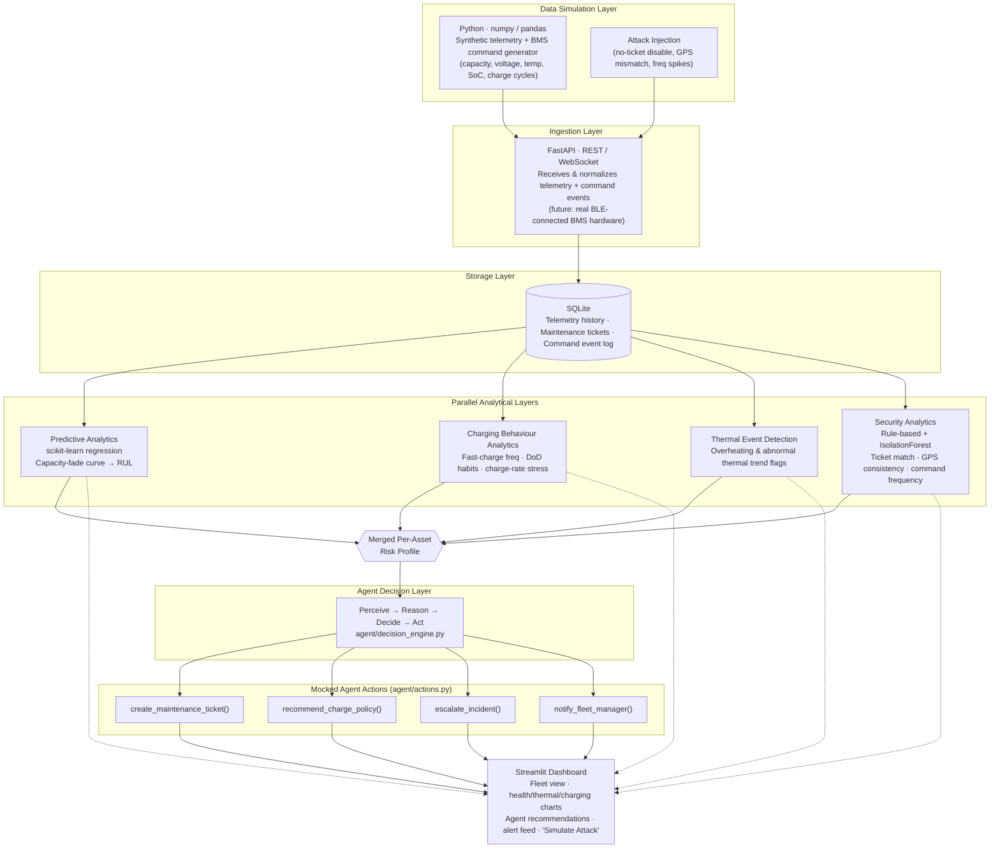
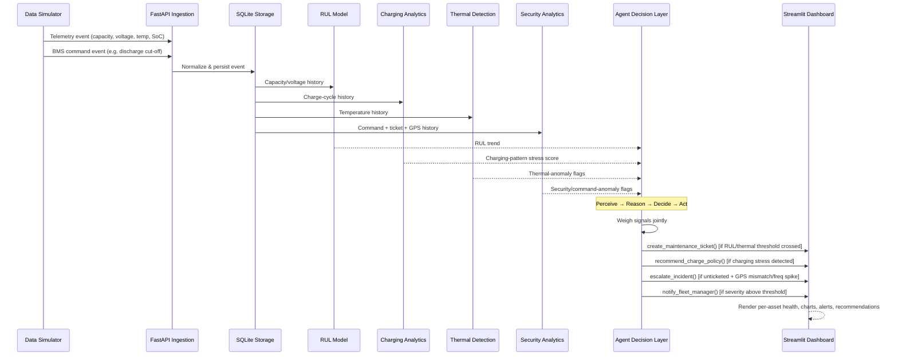
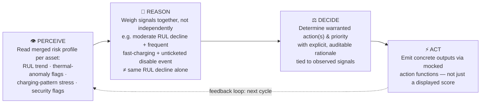

# VoltSentinel

**AI-Powered EV Battery Asset Performance & Security Intelligence Agent**

ET AI Hackathon 2026 — Problem Statement 3: _AI for Industrial EV Supply Chain & Asset Intelligence: Accelerating Net Zero_

> Team Name: `[Add team name]` · Team Members: `[Add member names]`

---

## Table of Contents

1. [Executive Summary](#executive-summary)
2. [Problem Statement & Context](#problem-statement--context)
3. [Objectives](#objectives)
4. [Proposed Solution](#proposed-solution)
5. [System Architecture](#system-architecture)
6. [Data Flow](#data-flow)
7. [Agent Decision Layer](#agent-decision-layer)
8. [Anomaly & Health Detection Logic](#anomaly--health-detection-logic)
9. [Data Simulation Approach](#data-simulation-approach)
10. [Implementation Timeline](#implementation-timeline-11-days)
11. [Alignment with Judging Criteria](#alignment-with-judging-criteria)
12. [Expected Deliverables](#expected-deliverables)
13. [Team](#team)
14. [Conclusion](#conclusion)

---

## Executive Summary

VoltSentinel is an AI-powered **Asset Performance Management (APM) agent** for industrial and commercial EV fleets. It monitors battery state-of-health, charging behaviour, and thermal conditions across a fleet; predicts **Remaining Useful Life (RUL)** per asset; recommends charge-discharge policies to extend battery life; and generates predictive maintenance triggers — the core capabilities of an APM agent, applied to EV batteries the way APM is applied to industrial machinery.

It extends this with a **security-aware reasoning layer** that treats unauthorized battery management system (BMS) control commands as a distinct stress event on the asset — alongside degradation and thermal signals, not separate from them. This closes a real and currently unresolved vulnerability affecting low-cost EV battery packs across India.

A **decision-making agent layer** sits above the scoring models: it takes the combined health, thermal, charging-behaviour, and security signals for an asset, reasons over them together, and emits concrete actions — a maintenance trigger, a charge-policy recommendation, or an incident escalation — rather than only displaying a score. This is what makes VoltSentinel an _agent_, in line with the PS3 track, rather than a monitoring dashboard.

The project is anchored to a live, ongoing regulatory and safety gap — the **"Tirri Challenge"** incidents of mid-2026 — giving the solution concrete, verifiable, real-world grounding.

---

## Problem Statement & Context

### Industry Context

India's industrial and commercial EV segment remains under-penetrated, and the primary barrier is no longer financial — it is **operational**. Fleet operators lack asset intelligence tools to manage EV battery lifecycle, maintenance, and charging infrastructure with the same rigour applied to conventional equipment. This is compounded by a supply chain built largely on low-cost, imported battery packs with inconsistent quality and security standards.

### The Security Gap: The "Tirri Challenge"

In mid-2026, a viral trend in India — dubbed the "Tirri Challenge" — saw pranksters use Chinese battery management companion apps (including BAT-BMS, Lossigy, and Epoch i-ion) to remotely disable moving e-rickshaws. The apps connected over **unauthenticated Bluetooth** to the vehicle's BMS and triggered its discharge cut-off, stopping the vehicle in live traffic.

The root cause was the **absence of authentication** — open Bluetooth access, default or no credentials, and no verification of who was issuing administrative commands. The government's response was reactive (app removal); it did not fix the underlying hardware/firmware vulnerability across the installed base. No mandatory security standard has been announced, and any similarly-capable app could reproduce the exploit.

From an APM standpoint, each unauthorized command is also an **unplanned, non-ticketed stress event** on the battery — functionally comparable to a thermal event or an abusive discharge cycle. VoltSentinel treats it as such: a health-relevant signal the agent reasons over, not a bolt-on security feature.

---

## Objectives

- Monitor battery state-of-health, charging-cycle patterns, and thermal events across a simulated EV fleet, in line with standard APM practice.
- Predict Remaining Useful Life (RUL) and degradation trajectory per asset.
- Generate predictive maintenance triggers and optimal charge-discharge recommendations per asset, not just a health score.
- Detect BMS control commands that show signs of unauthorized use, and reason over them as a health-stress signal alongside thermal and charging data.
- Distinguish legitimate maintenance shutdowns from suspected "Tirri Challenge"-style attacks in real time, using explainable, auditable logic.
- Act as an **agent**: perceive combined asset signals, reason over them, and decide/emit concrete actions — not only classify and display.
- Present health, prescriptive, and security signals in a single, unified operator view.
- Demonstrate the concept end-to-end using simulated data, given no access to real fleet or BMS telemetry.

---

## Proposed Solution

### Core Concept

VoltSentinel ingests battery telemetry and BMS command events for a simulated fleet, and routes them through analytical layers built on a shared data pipeline: a health/degradation layer (RUL), a charging-behaviour layer, a thermal-event layer, and a security layer that scores each control command against contextual signals — matching maintenance ticket, GPS location consistency, and command frequency. These merge into a single per-asset risk profile.

An **agent decision layer** then reasons over that merged profile — the way a human asset manager would weigh multiple signals together — and emits the outputs an APM agent is expected to produce: predictive maintenance triggers, charge-discharge recommendations, and, where warranted, a security escalation.

### Key Differentiator: Not Another BMS App

| Aspect                   | BMS Companion App (e.g. BAT-BMS)  | VoltSentinel                                                                               |
| ------------------------ | --------------------------------- | ------------------------------------------------------------------------------------------ |
| User                     | Individual driver / vehicle owner | Fleet manager / operator                                                                   |
| Scope                    | One vehicle at a time             | Entire fleet, aggregated                                                                   |
| Relationship to commands | Sends commands to the BMS         | Observes and evaluates commands sent to the BMS                                            |
| Security awareness       | None — accepts any nearby command | Treats unauthorized commands as a health-stress signal within the agent's reasoning        |
| Predictive capability    | None — current readings only      | RUL forecasting, thermal-event detection, charging-pattern analysis                        |
| Prescriptive capability  | None                              | Charge-discharge recommendations and predictive maintenance triggers, emitted by the agent |
| Agentic behaviour        | None — passive control tool       | Perceives multi-signal state, reasons, and emits/recommends actions                        |

VoltSentinel does not attempt to fix the underlying BMS authentication gap — that is a manufacturer and regulatory responsibility. Instead, it provides a **deployable APM agent** for fleet operators who cannot wait for every unit in the field to receive a firmware fix.

---

## System Architecture

The system follows a single linear data pipeline that fans out into parallel analytical layers, converges into a merged per-asset risk profile, and is then reasoned over by an agent decision layer before reaching the dashboard.

### Component Overview

| Layer                                    | Technology & Role                                                                                                                                                                                                                             |
| ---------------------------------------- | --------------------------------------------------------------------------------------------------------------------------------------------------------------------------------------------------------------------------------------------- |
| **Data Simulation**                      | Python (numpy, pandas) — generates synthetic battery telemetry (capacity, voltage, temperature, SoC, charge-cycle behaviour) for the fleet and injects both normal maintenance events and unauthorized-command "attack" events.               |
| **Ingestion**                            | FastAPI (REST / WebSocket) — receives and normalizes incoming telemetry and command events; the boundary where real BLE-connected BMS hardware would plug in.                                                                                 |
| **Storage**                              | SQLite — stores telemetry history, mock maintenance ticket records, and the command event log.                                                                                                                                                |
| **Predictive Analytics**                 | scikit-learn (regression) — fits a capacity-fade curve per asset and extrapolates Remaining Useful Life (RUL).                                                                                                                                |
| **Charging Behaviour Analytics** _[NEW]_ | Analyzes charge-cycle patterns per asset — fast-charge frequency, depth-of-discharge habits, charge-rate stress — as an input to both RUL and the agent's charge-policy recommendations.                                                      |
| **Thermal Event Detection** _[NEW]_      | Flags overheating and abnormal thermal trends from telemetry as a distinct health-anomaly signal, separate from command/security anomalies.                                                                                                   |
| **Security Analytics**                   | Rule-based logic, optionally supplemented with scikit-learn IsolationForest — scores each command against maintenance-ticket match, GPS consistency, and command frequency.                                                                   |
| **Agent Decision Layer** _[NEW]_         | Perceive → reason → decide → act loop over the merged RUL + thermal + charging + security profile per asset. Emits predictive maintenance triggers, charge-discharge recommendations, and security escalations (mocked actions for the demo). |
| **Presentation**                         | Streamlit — unified fleet dashboard with per-asset health charts, charge/thermal indicators, agent recommendations, a live alert feed, and a "Simulate Attack" trigger for demonstration.                                                     |

---

## Data Flow

End-to-end journey of a single telemetry/command event through the system:

---

## Agent Decision Layer

This is the component that makes VoltSentinel an **agent** rather than a scoring dashboard, and it is the direct answer to the APM Agent brief's call for predictive maintenance triggers and charge-discharge recommendations, not just RUL numbers.

### Perceive → Reason → Decide → Act

### Emitted Actions

| Action                              | Trigger Condition (example)                                                                | Output                                                                                    |
| ----------------------------------- | ------------------------------------------------------------------------------------------ | ----------------------------------------------------------------------------------------- |
| **Predictive maintenance trigger**  | RUL crosses a defined threshold, or a thermal anomaly persists across cycles               | `create_maintenance_ticket()` — mock ticket with asset ID, reason, priority               |
| **Charge-discharge recommendation** | Charging-pattern analysis shows high fast-charge frequency or excessive depth-of-discharge | `recommend_charge_policy()` — e.g. cap charge rate, limit DoD to extend RUL               |
| **Security escalation**             | Unticketed command + GPS mismatch and/or frequency spike                                   | `escalate_incident()` — flags for fleet-manager review, distinct from routine maintenance |
| **Fleet manager notification**      | Any high-priority decision above a severity threshold                                      | `notify_fleet_manager()` — mocked notification for demo purposes                          |

For the hackathon build, these actions are mocked functions (`agent/actions.py`) rather than live integrations — sufficient to demonstrate agentic behaviour end-to-end without requiring external systems.

---

## Anomaly & Health Detection Logic

### Security / Command Anomalies

A BMS control command (e.g. discharge cut-off, disable) is flagged as suspicious when it exhibits one or more of the following:

- No matching maintenance ticket exists for the command at the time it was issued.
- The vehicle's GPS location at the time of the command is inconsistent with a known depot or service location (e.g. the vehicle is in motion on a public road).
- The frequency of control commands for that asset spikes well above its historical baseline within a short time window.

Commands matching a valid maintenance ticket and an expected service location are treated as legitimate and excluded from alerting.

### Thermal Event Detection _[NEW]_

Temperature telemetry is analyzed as its own signal, independent of command anomalies:

- Sustained temperature readings above asset-specific safe operating thresholds.
- Abnormal rate-of-change in temperature relative to charge/discharge state.
- Repeated thermal flags correlated with specific charge-cycle behaviour, feeding both the RUL model and the agent's charge-policy recommendations.

### Charging Pattern Analysis _[NEW]_

Charging behaviour is analyzed as a distinct signal contributing to both degradation modeling and prescriptive output:

- Fast-charge frequency relative to fleet baseline.
- Depth-of-discharge (DoD) habits per asset.
- Charge-rate stress trends over time, used to generate charge-discharge recommendations via the agent layer.

This keeps all detection and recommendation logic explainable and auditable — an important property for a fleet-operator-facing safety and asset-management tool.

---

## Data Simulation Approach

With no access to real fleet or BMS data, the simulator is the foundation the rest of the system depends on. It generates, for a configurable fleet size and cycle count, per-vehicle battery telemetry — capacity, voltage, temperature, state of charge, and charge-cycle behaviour — following an exponential degradation trend with realistic noise, alongside a corresponding stream of BMS command events.

A separate injection process introduces "attack" events into the command stream at controlled points: unauthorized discharge/disable commands with no maintenance ticket, a GPS position away from any depot, or a burst of repeated commands — mirroring the mechanics of the real Tirri Challenge incidents. This allows the detection layer to be validated against known-injected events, and allows the live demo to trigger a realistic scenario on demand and observe the agent's resulting decision.

---

## Implementation Timeline (11 Days)

| Day | Focus                                                                                                                                                      |
| --- | ---------------------------------------------------------------------------------------------------------------------------------------------------------- |
| 1   | Project setup; begin telemetry simulator (normal battery decay, charging behaviour, and BMS command generation).                                           |
| 2–3 | Complete simulator; build attack injection logic (no-ticket disable, GPS mismatch, frequency spikes).                                                      |
| 4   | FastAPI ingestion service and SQLite schema.                                                                                                               |
| 5–6 | RUL regression model; anomaly detector extended to cover command, thermal, and charging-pattern signals.                                                   |
| 6–7 | Agent decision layer (`agent/decision_engine.py`): reasoning over merged signals, mocked action functions, charge-discharge and maintenance-trigger logic. |
| 7–8 | Streamlit dashboard — fleet view, health/thermal/charging charts, agent recommendations panel, alert feed, "Simulate Attack" trigger.                      |
| 9   | End-to-end integration testing across the full pipeline, including agent decision scenarios.                                                               |
| 10  | Finalize architecture diagram, presentation deck, and record demo video.                                                                                   |
| 11  | Buffer, rehearsal, and submission.                                                                                                                         |

---

## Alignment with Judging Criteria

| Criterion                | Weight | How VoltSentinel Addresses It                                                                                                                                                                                  |
| ------------------------ | ------ | -------------------------------------------------------------------------------------------------------------------------------------------------------------------------------------------------------------- |
| **Innovation**           | 25%    | Agentic reasoning over combined health, thermal, charging, and security signals, tied to a real, unresolved regulatory gap — rather than a generic battery-health dashboard.                                   |
| **Business Impact**      | 25%    | Protects fleet revenue and driver safety, reduces unplanned downtime via predictive triggers and charge-policy guidance, in a segment with a live public-safety incident and no deployed detection tooling.    |
| **Technical Excellence** | 20%    | Multi-signal pipeline (RUL regression, thermal detection, charging-pattern analysis, security anomaly detection) converging into an agent decision layer that reasons and acts on a shared real-time pipeline. |
| **Scalability**          | 15%    | Modular pipeline (simulation, ingestion, storage, models, agent, dashboard) designed to accept real BLE-connected BMS input in place of the simulator, and to swap mocked actions for live integrations.       |
| **User Experience**      | 15%    | Single unified dashboard combining health, prescriptive, and security signals per asset, with agent-generated recommendations and a live, on-demand attack simulation for a clear demo narrative.              |

---

## Expected Deliverables

| Deliverable                                    | Status                                                                    |
| ---------------------------------------------- | ------------------------------------------------------------------------- |
| Working Prototype (incl. agent decision layer) | In progress                                                               |
| Architecture Diagram                           | Complete — updated to reflect agent layer                                 |
| Presentation Deck                              | Pending                                                                   |
| Demo Video                                     | Pending — to be recorded ahead of submission as a backup to the live demo |

---

## Team

- **Team Name:** `btech10364.23`
- **Members:** `Yash Sinha`
- **Hackathon:** ET AI Hackathon 2026
- **Problem Statement:** PS3 — AI for Industrial EV Supply Chain & Asset Intelligence

---

## Conclusion

VoltSentinel is an EV Asset Performance Management agent: it monitors battery state-of-health, charging patterns, and thermal events across a fleet, predicts Remaining Useful Life, and — through its agent decision layer — generates predictive maintenance triggers and optimal charge-discharge recommendations per asset, the core capabilities asked for in the brief.

It extends this with a security-aware reasoning layer that treats unauthorized BMS commands as a further health-stress signal, grounding the project in a real, current, and still-unresolved vulnerability without displacing the core APM scope. By keeping detection and recommendation logic explainable, and by having the agent reason over combined signals to decide and act rather than only classify and display, VoltSentinel aims to deliver a differentiated, credible, and buildable submission within the two-week hackathon window.
